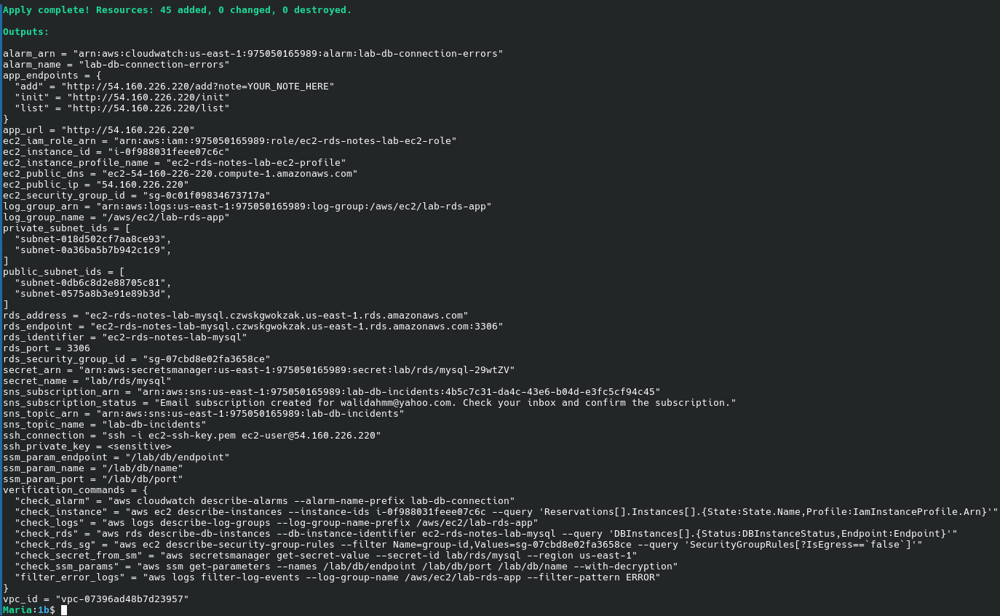
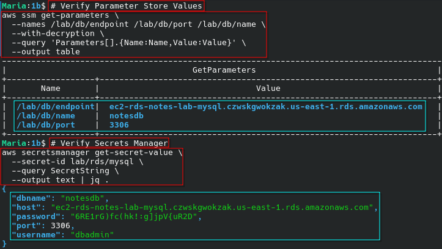
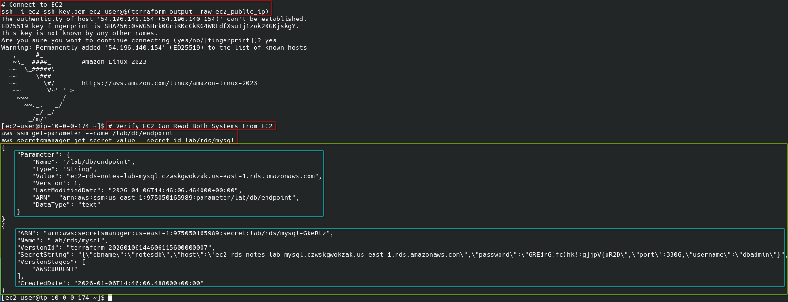
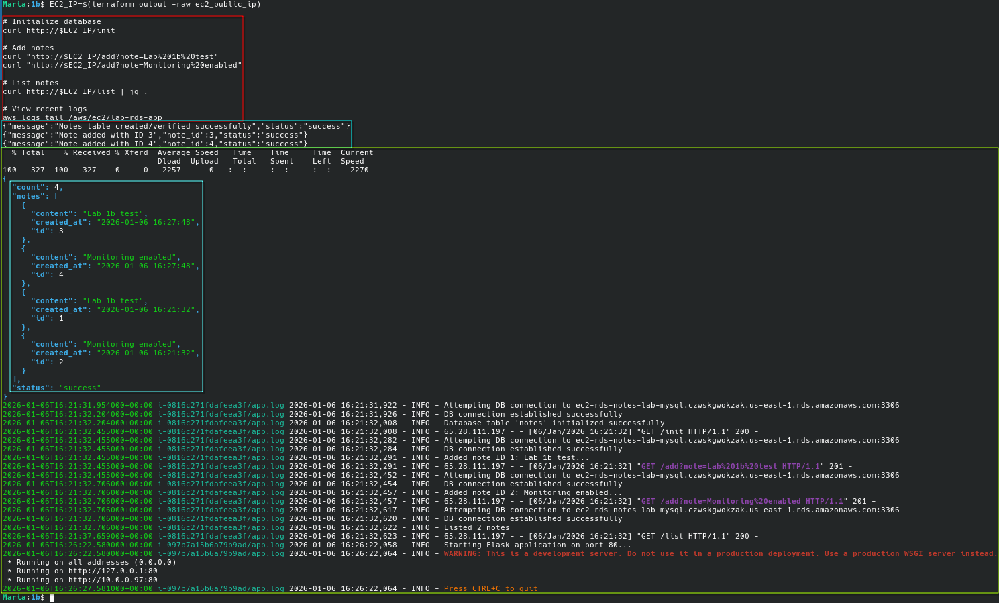
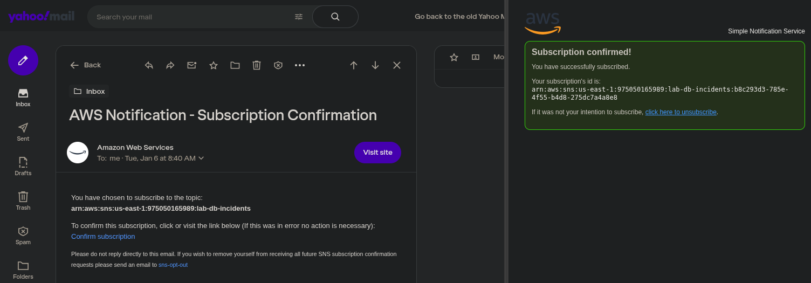
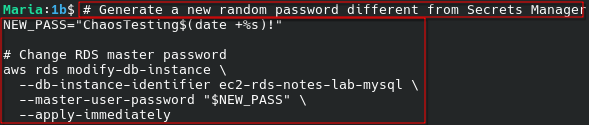
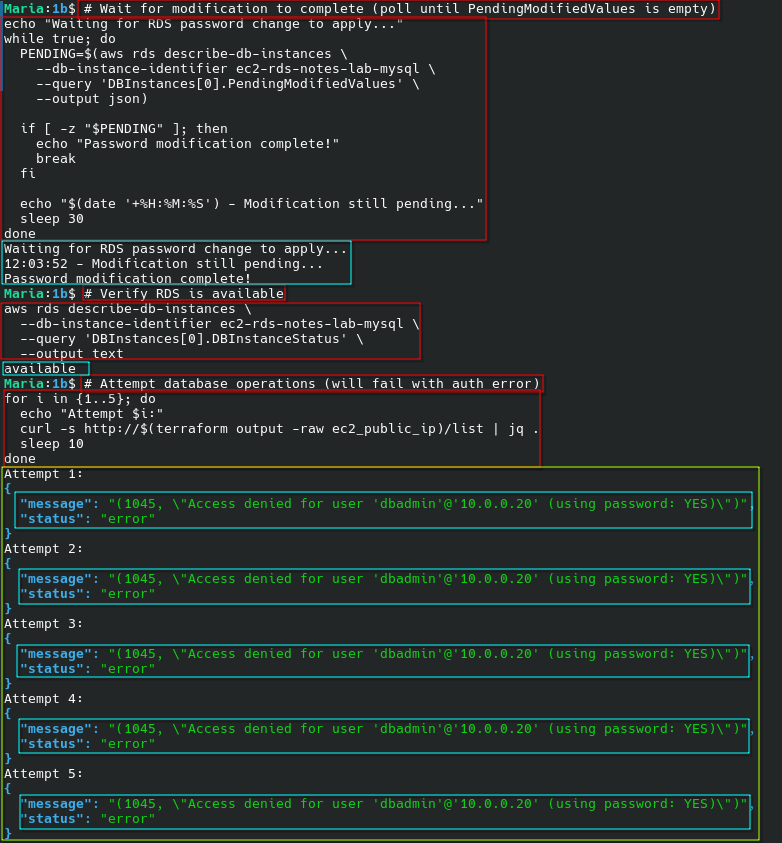
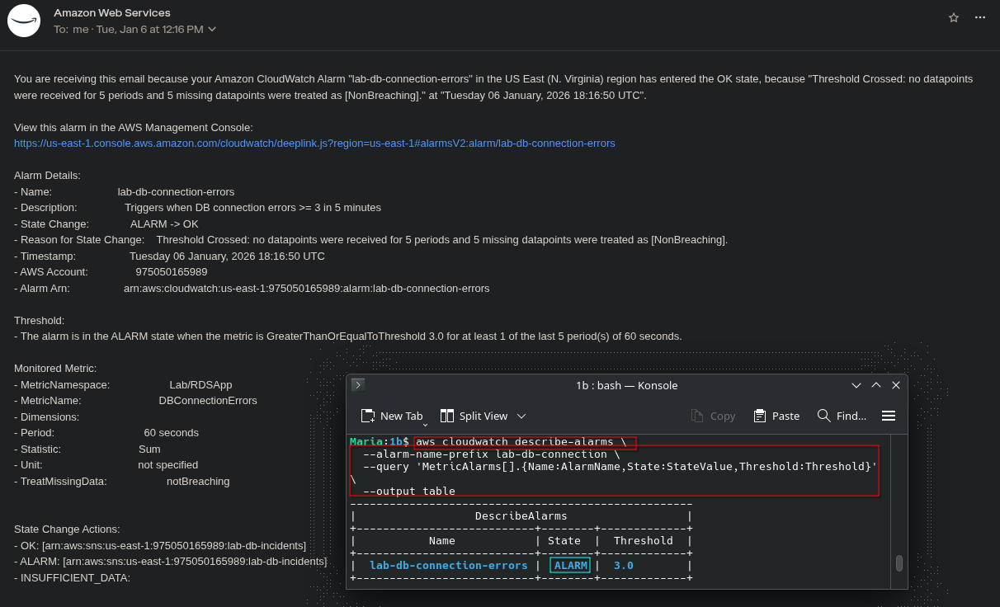
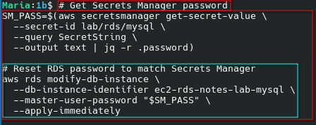
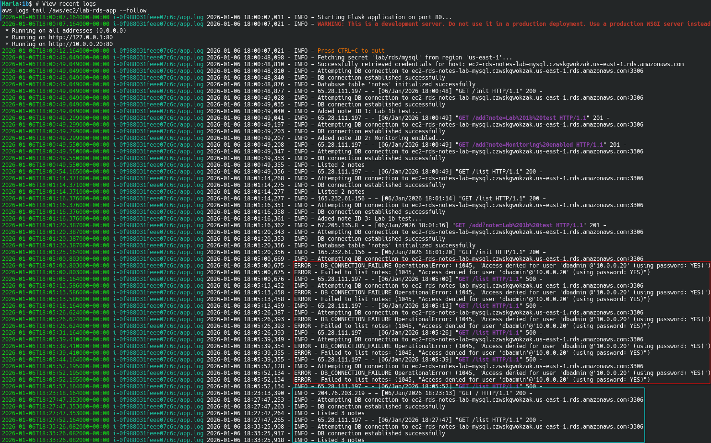

# EC2 → RDS MySQL Notes Application (Lab 1b: Operations & Incident Response)

[](https://www.terraform.io/)
[](https://registry.terraform.io/providers/hashicorp/aws/latest)
[](https://aws.amazon.com/linux/amazon-linux-2023/)

Lab 1b extends Lab 1a with **operations, observability, and incident response** capabilities for production-ready database application monitoring.

## What's New in Lab 1b

### Operational Enhancements

- **Dual Secret Storage**: AWS Systems Manager Parameter Store for operational metadata (endpoint, port, dbname)
- **Centralized Logging**: CloudWatch Logs integration with real-time log shipping
- **Proactive Monitoring**: CloudWatch Metric Filter detecting DB connection failures
- **Automated Alerting**: CloudWatch Alarm triggering on connection error threshold
- **Incident Notifications**: SNS topic for alarm state changes
- **Incident Response**: Comprehensive runbook with CLI-based recovery procedures

### Architecture Changes from 1a

```diff
+ AWS Systems Manager Parameter Store
+   - /lab/db/endpoint
+   - /lab/db/port
+   - /lab/db/name
+ CloudWatch Logs
+   - /aws/ec2/lab-rds-app
+ CloudWatch Metric Filter
+   - Pattern: "DB_CONNECTION_FAILURE" (literal string match)
+ CloudWatch Alarm
+   - lab-db-connection-errors
+ SNS Topic
+   - lab-db-incidents
+ Enhanced IAM Permissions
+   - ssm:GetParameter
+   - logs:CreateLogStream, PutLogEvents 
+   - cloudwatch:PutMetricData
```

---

## Features

- ✅ **Security Group-to-Security Group References** - No CIDR-based database access
- ✅ **Dual Secret Management** - Secrets Manager (credentials) + Parameter Store (metadata)
- ✅ **CloudWatch Logs Integration** - Real-time application log streaming
- ✅ **Error Detection** - Automated pattern matching for DB connection failures
- ✅ **Threshold-Based Alerting** - >= 3 errors in 5 minutes triggers alarm
- ✅ **SNS Notifications** - Incident alert delivery channel
- ✅ **Incident Response Runbook** - Includes chaos engineering tests to practice recovery procedures
- ✅ **IAM Instance Profiles** - Secure AWS API authentication
- ✅ **Private RDS Deployment** - Database isolated in private subnets
- ✅ **Multi-AZ Architecture** - High availability across 2 availability zones
- ✅ **IMDSv2 Required** - Enhanced instance metadata security
- ✅ **Encrypted Storage** - Both EBS and RDS encryption enabled
- ✅ **Free Tier Compatible** - Uses t3.micro and db.t3.micro instances

---

## Architecture

```
                         VPC (10.0.0.0/16)
    ┌─────────────────────────────────────────────────────────┐
    │                                                         │
    │   Public Subnets              Private Subnets           │
    │   ┌─────────────┐             ┌─────────────┐           │
    │   │  10.0.0.0/24│             │10.0.100.0/24│           │
    │   │    (AZ-a)   │             │    (AZ-a)   │           │
    │   │             │             │             │           │
    │   │ ┌─────────┐ │   SG Ref    │ ┌─────────┐ │           │
    │   │ │   EC2   │─┼─────────────┼─│   RDS   │ │           │
    │   │ │  Flask  │ │  TCP/3306   │ │  MySQL  │ │           │
    │   │ └────┬────┘ │             │ └─────────┘ │           │
    │   └─────┼───────┘             └─────────────┘           │
    │         │                                               │
    │         │                                               │
    │   ┌─────────────┐             ┌─────────────┐           │
    │   │  10.0.1.0/24│             │10.0.101.0/24│           │
    │   │    (AZ-b)   │             │    (AZ-b)   │           │
    │   └─────────────┘             └─────────────┘           │
    │         │                                               │
    └─────────┼───────────────────────────────────────────────┘
              │
         ┌────┴────┐
         │   IGW   │
         └────┬────┘
              │
          Internet

    EC2 --> IAM Role --> {Secrets Manager, SSM Params, CloudWatch}
                              │
                              ├─ Get DB Creds (Secrets Manager)
                              ├─ Get DB Metadata (SSM)
                              ├─ Ship Logs (CloudWatch Logs)
                              └─ Metric Filter → Alarm → SNS
```

**Monitoring Flow:**
1. Application logs DB connection failures with `DB_CONNECTION_FAILURE` token
2. CloudWatch Agent ships `/var/log/notes-app.log` to CloudWatch Logs
3. Metric Filter matches literal string `"DB_CONNECTION_FAILURE"`
4. Custom metric `DBConnectionErrors` increments
5. Alarm triggers when Sum(errors) >= 3 in 5 minutes
6. SNS topic sends notification (email subscriptions done manually)

---

## Architectural Note: Database Connection as a Contract

This lab treats the database connection JSON in Secrets Manager as a **contract** between Terraform (producer) and the application (consumer). Secrets Manager provides the distribution, access-control, and rotation plane; the application consumes a stable JSON interface and should not need to know where individual values originate. This pattern—bundling credentials (`username`, `password`) and connection metadata (`host`, `port`, `dbname`) in a single secret—is the default, reliability-first approach. It ensures atomicity: all values needed to form a working connection are retrieved in a single API call, eliminating partial-read failure modes and reducing network round-trips.

Splitting credentials into Secrets Manager and metadata into SSM Parameter Store is a valid **variation**, but only justified when:
- Different IAM access boundaries are required (e.g., developers read connection metadata but not credentials)
- Different lifecycle or rotation schedules exist (e.g., connection strings change independently from passwords)
- Routing information changes independently and frequently (rare in practice for RDS endpoints)

**This lab intentionally chooses bundling** because the values are consumed together to form a single working database connection, simplicity and reliability are prioritized over premature separation, and there is no meaningful IAM or lifecycle boundary requiring the split. The dual-storage approach demonstrated in Lab 1b (Parameter Store for `endpoint`, `port`, `dbname`) exists solely for **learning purposes**—to show both AWS secret storage mechanisms in a single lab environment, not because it is architecturally superior for this use case.

---

## Quick Start

### Prerequisites
- AWS CLI configured with appropriate credentials
- Terraform >= 1.5.0
- `jq` installed (for parsing JSON outputs)

### Deployment

```bash
# Initialize Terraform
cd 1b
terraform init

# Review planned changes
terraform plan

# Deploy infrastructure (RDS creation takes ~5-10 minutes)
# Optional: Add -var="alert_email=your@email.com" to receive alarm notifications
terraform apply

# Wait 2-3 minutes for EC2 user-data and CloudWatch Agent setup
EC2_IP=$(terraform output -raw ec2_public_ip)

# Verify CloudWatch Logs agent is shipping logs
aws logs describe-log-streams \
  --log-group-name /aws/ec2/lab-rds-app \
  --order-by LastEventTime \
  --descending

# Initialize database
curl http://$EC2_IP/init

# Add notes
curl "http://$EC2_IP/add?note=Lab%201b%20test"
curl "http://$EC2_IP/add?note=Monitoring%20enabled"

# List notes
curl http://$EC2_IP/list | jq .

# Verify logs in CloudWatch
aws logs filter-log-events \
  --log-group-name /aws/ec2/lab-rds-app \
  --filter-pattern "INFO" \
  --max-items 10
```

### Expected Output

**After `terraform apply` completes:**

```
Apply complete! Resources: 24 added, 0 changed, 0 destroyed.

Outputs:

alarm_arn = "arn:aws:cloudwatch:us-east-1:123456789012:alarm:lab-db-connection-errors"
alarm_name = "lab-db-connection-errors"
db_endpoint = "lab-mysql.abc123xyz.us-east-1.rds.amazonaws.com"
ec2_public_ip = "54.123.45.67"
log_group_arn = "arn:aws:logs:us-east-1:123456789012:log-group:/aws/ec2/lab-rds-app"
log_group_name = "/aws/ec2/lab-rds-app"
sns_topic_arn = "arn:aws:sns:us-east-1:123456789012:lab-db-incidents"
sns_topic_name = "lab-db-incidents"
sns_subscription_arn = "arn:aws:sns:us-east-1:123456789012:lab-db-incidents:12345678-1234-1234-1234-123456789012"
sns_subscription_status = "Email subscription created for your-email@example.com. Check your inbox and confirm the subscription."
ssm_param_endpoint = "/lab/db/endpoint"
ssm_param_name = "/lab/db/name"
ssm_param_port = "/lab/db/port"
```

**Note:** If `alert_email` variable was not set, the `sns_subscription_arn` and `sns_subscription_status` outputs will show:
```
sns_subscription_arn = "No email subscription (alert_email variable not set)"
sns_subscription_status = "No email subscription configured. Set alert_email variable to receive notifications."
```

**CloudWatch Logs verification:**

```bash
aws logs describe-log-streams \
  --log-group-name /aws/ec2/lab-rds-app \
  --order-by LastEventTime \
  --descending
```

```json
{
  "logStreams": [
    {
      "logStreamName": "i-0abcd1234efgh5678/app.log",
      "creationTime": 1704384123000,
      "firstEventTimestamp": 1704384125000,
      "lastEventTimestamp": 1704384789000,
      "lastIngestionTime": 1704384791000,
      "uploadSequenceToken": "...",
      "arn": "arn:aws:logs:us-east-1:123456789012:log-group:/aws/ec2/lab-rds-app:log-stream:i-0abcd1234efgh5678/app.log",
      "storedBytes": 1234
    }
  ]
}
```

**Database initialization:**

```bash
curl http://$EC2_IP/init
```

```json
{
  "status": "success",
  "message": "Table 'notes' created successfully (or already exists)"
}
```

**Adding notes:**

```bash
curl "http://$EC2_IP/add?note=Lab%201b%20test"
```

```json
{
  "status": "success",
  "note_id": 1
}
```

**Listing notes:**

```bash
curl http://$EC2_IP/list | jq .
```

```json
{
  "status": "success",
  "count": 2,
  "notes": [
    {
      "id": 1,
      "content": "Lab 1b test",
      "created_at": "2026-01-04 19:30:15"
    },
    {
      "id": 2,
      "content": "Monitoring enabled",
      "created_at": "2026-01-04 19:30:22"
    }
  ]
}
```

**CloudWatch Logs filter output:**

```bash
aws logs filter-log-events \
  --log-group-name /aws/ec2/lab-rds-app \
  --filter-pattern "INFO" \
  --max-items 10
```

```json
{
  "events": [
    {
      "logStreamName": "i-0abcd1234efgh5678/app.log",
      "timestamp": 1704384615217,
      "message": "2026-01-04 19:30:15,217 - INFO - Starting Flask application",
      "ingestionTime": 1704384616123,
      "eventId": "..."
    },
    {
      "logStreamName": "i-0abcd1234efgh5678/app.log",
      "timestamp": 1704384622458,
      "message": "2026-01-04 19:30:22,458 - INFO - Database connection established",
      "ingestionTime": 1704384623234,
      "eventId": "..."
    }
  ],
  "searchedLogStreams": [
    {
      "logStreamName": "i-0abcd1234efgh5678/app.log",
      "searchedCompletely": true
    }
  ]
}
```

**Email confirmation (if `alert_email` was set):**

Check your inbox for an email from AWS Notifications with subject:
```
AWS Notification - Subscription Confirmation
```

Click the "Confirm subscription" link to activate alarm notifications.

---

## Lab 1b Verification Steps

### 1. Verify Parameter Store Values

```bash
aws ssm get-parameters \
  --names /lab/db/endpoint /lab/db/port /lab/db/name \
  --with-decryption \
  --query 'Parameters[].{Name:Name,Value:Value}' \
  --output table
```

**Expected:** Endpoint, port (3306), and database name

### 2. Verify Secrets Manager (Still Works)

```bash
aws secretsmanager get-secret-value \
  --secret-id lab/rds/mysql \
  --query SecretString \
  --output text | jq .
```

**Expected:** JSON with username, password, host, port, dbname

### 3. Verify CloudWatch Logs Integration

```bash
# Check log group exists
aws logs describe-log-groups \
  --log-group-name-prefix /aws/ec2/lab-rds-app

# View recent logs
aws logs tail /aws/ec2/lab-rds-app --follow
```

### 4. Verify CloudWatch Alarm

```bash
aws cloudwatch describe-alarms \
  --alarm-name-prefix lab-db-connection \
  --query 'MetricAlarms[].{Name:AlarmName,State:StateValue,Threshold:Threshold}' \
  --output table
```

**Expected:** Alarm in `OK` or `INSUFFICIENT_DATA` state (not `ALARM` unless errors occurred)

### 5. Test Error Detection and Email Notifications

**⚠️ Important:** CloudWatch alarms send emails only on **state transitions**, not while staying in the same state:
- ✅ OK → ALARM: Sends ALARM email
- ✅ ALARM → OK: Sends OK email
- ❌ ALARM → ALARM: No email (already in alarm state)

**Full Test Cycle (recommended for testing email notifications):**

**Step 1: Ensure alarm is in OK state**
```bash
# Check current state
aws cloudwatch describe-alarms \
  --alarm-names lab-db-connection-errors \
  --query 'MetricAlarms[0].{State:StateValue,Since:StateUpdatedTimestamp}' \
  --output table

# If INSUFFICIENT_DATA or ALARM, wait or fix to reach OK state first
```

**Step 2: Break - Remove security group rule**
```bash
RDS_SG=$(terraform output -raw rds_security_group_id)
RULE_ID=$(aws ec2 describe-security-group-rules \
  --filters "Name=group-id,Values=$RDS_SG" \
  --query 'SecurityGroupRules[?IsEgress==`false`].SecurityGroupRuleId' \
  --output text)

# Remove rule (causes connection failures)
aws ec2 revoke-security-group-ingress \
  --group-id $RDS_SG \
  --security-group-rule-ids $RULE_ID
```

**Step 3: Generate errors to trigger alarm**
```bash
# Generate 5+ connection attempts (threshold is >= 3 errors in 5 minutes)
for i in {1..5}; do
  curl http://$(terraform output -raw ec2_public_ip)/list
  sleep 2
done
```

**Expected output:** `{"status":"error","message":"(2003, \"Can't connect to MySQL server...\")"}`

**Step 4: Verify logs contain DB_CONNECTION_FAILURE token**
```bash
aws logs filter-log-events \
  --log-group-name /aws/ec2/lab-rds-app \
  --filter-pattern "DB_CONNECTION_FAILURE" \
  --start-time $(date -u -d '10 minutes ago' +%s)000 \
  --max-items 5 \
  --query 'events[*].message' \
  --output text
```

**Expected:** `2026-01-05 00:22:35,217 - ERROR - DB_CONNECTION_FAILURE OperationalError: (2003, "Can't connect...")`

**Step 5: Wait for alarm to trigger (5-7 minutes)**
```bash
# Check alarm state periodically
watch -n 30 'aws cloudwatch describe-alarms --alarm-names lab-db-connection-errors --query "MetricAlarms[0].StateValue" --output text'
```

**Expected:** State changes from OK → ALARM
**Email received:** "ALARM: lab-db-connection-errors in US East (N. Virginia)"

**Step 6: Fix - Restore security group rule**
```bash
EC2_SG=$(terraform output -raw ec2_security_group_id)
RDS_SG=$(terraform output -raw rds_security_group_id)

aws ec2 authorize-security-group-ingress \
  --group-id "$RDS_SG" \
  --ip-permissions IpProtocol=tcp,FromPort=3306,ToPort=3306,UserIdGroupPairs="[{GroupId=$EC2_SG,Description='MySQL from EC2 security group'}]"
```

**Step 7: Verify recovery**
```bash
# Test database connection
curl http://$(terraform output -raw ec2_public_ip)/list | jq .

# Wait 5-10 minutes for alarm to return to OK
aws cloudwatch describe-alarms \
  --alarm-names lab-db-connection-errors \
  --query 'MetricAlarms[0].StateValue' \
  --output text
```

**Expected:** State changes from ALARM → OK
**Email received:** "OK: lab-db-connection-errors in US East (N. Virginia)"

**Verification complete when:**
- ✅ Received both ALARM and OK emails
- ✅ Alarm history shows SNS action executions:
  ```bash
  aws cloudwatch describe-alarm-history \
    --alarm-name lab-db-connection-errors \
    --max-records 5
  ```

**If no emails received:** See **[RUNBOOK.md Issue 5](RUNBOOK.md#issue-5-sns-email-not-received)** for debugging steps

---

## Chaos Engineering & Failure Testing

For comprehensive testing of monitoring, alerting, and incident response capabilities, see the **[Chaos Engineering section in RUNBOOK.md](RUNBOOK.md#chaos-engineering-failure-mode-simulations)**.

This section provides controlled procedures to deliberately trigger all three common failure modes:

1. **Credential Drift** - Simulates password mismatch between Secrets Manager and RDS
2. **Network Isolation** - Removes security group rules to test network failure detection
3. **Database Unavailability** - Stops RDS instance to test database outage handling

Each test includes:
- ✅ Step-by-step injection procedures
- ✅ Monitoring verification steps
- ✅ Direct references to incident response procedures
- ✅ Recovery validation
- ✅ Expected timelines and outcomes

**Automated test suite:** Run all three scenarios with `chaos-test-suite.sh` (~30-40 minutes total)

**Use cases:**
- Validate alarm thresholds and evaluation periods
- Practice incident response procedures before real incidents
- Train team members on recovery workflows
- Verify SNS email notifications are working
- Test CloudWatch metric filter pattern accuracy

⚠️ **Note:** Chaos tests cause application downtime and trigger alarms. Only run in non-production environments.

---

## Configuration

### New Variables (Lab 1b)

| Variable | Type | Default | Description |
|----------|------|---------|-------------|
| `log_group_name` | string | `/aws/ec2/lab-rds-app` | CloudWatch Logs log group name |
| `log_retention_days` | number | `7` | Log retention period |
| `alarm_error_threshold` | number | `3` | Error count to trigger alarm |
| `alarm_evaluation_period` | number | `5` | Evaluation window (minutes) |
| `sns_topic_name` | string | `lab-db-incidents` | SNS topic for notifications |
| `alert_email` | string | `""` (empty) | Email address for alarm notifications |

**Note:** SSH key pair is automatically generated during `terraform apply`. The private key is available as a sensitive Terraform output (not written to disk automatically for security). The `key_name` variable has been removed in favor of automatic key generation.

### Enable SSH Access

SSH key pair is automatically generated during `terraform apply`. To enable SSH access, set the `ssh_allowed_cidr` variable:

```bash
terraform apply \
  -var="ssh_allowed_cidr=YOUR_IP/32"
```

After deployment, save the private key and connect:
```bash
# Save the private key to a file (only when needed)
terraform output -raw ssh_private_key > ec2-ssh-key.pem
chmod 400 ec2-ssh-key.pem

# Connect to EC2
ssh -i ec2-ssh-key.pem ec2-user@$(terraform output -raw ec2_public_ip)
```

⚠️ **SECURITY WARNING:** Read **[SECURITY.md](SECURITY.md)** before extracting the SSH key. The private key is stored in Terraform state (encrypted S3 backend). Extracting it to disk relies on `.gitignore` and your memory to prevent accidental commits to version control. Delete `ec2-ssh-key.pem` immediately after use.

### Setting Up Email Notifications

**Option 1: Terraform-Managed Subscription (Recommended)**

Set the `alert_email` variable during deployment:

```bash
terraform apply \
  -var="alert_email=your-email@example.com"
```

After deployment:
1. Check your email inbox for AWS Notification subscription confirmation
2. Click the confirmation link
3. You'll receive notifications when the alarm triggers

**Option 2: Manual AWS CLI Subscription**

```bash
# Get SNS topic ARN
SNS_TOPIC=$(terraform output -raw sns_topic_arn)

# Subscribe your email
aws sns subscribe \
  --topic-arn $SNS_TOPIC \
  --protocol email \
  --notification-endpoint your-email@example.com

# Confirm subscription via email link
```

**Note:** Email subscriptions always require manual email confirmation (AWS security requirement). Terraform creates the subscription in "PendingConfirmation" state until you click the link.

---

## Incident Response

When the alarm `lab-db-connection-errors` triggers:

1. **Check alarm state:**
```bash
aws cloudwatch describe-alarms --alarm-names lab-db-connection-errors
```

2. **Review ERROR logs:**
```bash
aws logs filter-log-events \
  --log-group-name /aws/ec2/lab-rds-app \
  --filter-pattern "ERROR"
```

3. **Follow the runbook:**
See **[RUNBOOK.md](RUNBOOK.md)** for complete diagnostic and recovery procedures:
- Credential drift recovery
- Network isolation fixes
- DB availability restoration
- Post-incident verification

---

## Troubleshooting

### CloudWatch Agent Not Running

```bash
# SSH to EC2 instance (key automatically generated, save when needed)
terraform output -raw ssh_private_key > ec2-ssh-key.pem
chmod 400 ec2-ssh-key.pem
ssh -i ec2-ssh-key.pem ec2-user@$(terraform output -raw ec2_public_ip)

# Check agent status
sudo systemctl status amazon-cloudwatch-agent

# Restart if needed
sudo systemctl restart amazon-cloudwatch-agent

# View agent logs
sudo tail -f /opt/aws/amazon-cloudwatch-agent/logs/amazon-cloudwatch-agent.log
```

### Logs Not Appearing in CloudWatch

**Check IAM permissions:**
```bash
aws iam get-role-policy \
  --role-name ec2-rds-notes-lab-ec2-role \
  --policy-name ec2-rds-notes-lab-cloudwatch-logs-access
```

**Verify log group exists:**
```bash
aws logs describe-log-groups --log-group-name-prefix /aws/ec2
```

**Check agent configuration:**
```bash
sudo cat /opt/aws/amazon-cloudwatch-agent/etc/cloudwatch-config.json
```

### Alarm Stuck in INSUFFICIENT_DATA

**Cause:** No metric data points generated yet

**Solution:** Trigger an error to generate data:
1. Temporarily stop RDS
2. Call any endpoint: `curl http://<IP>/list`
3. Start RDS
4. Alarm should transition to ALARM then OK

### Detailed Troubleshooting

See **[RUNBOOK.md](RUNBOOK.md)** for:
- Incident response procedures for database connection failures (credential drift, network isolation, DB unavailability)
- Complete diagnostic procedures from Lab 1a
- Lab 1b specific failure modes (CloudWatch Logs, metrics, alarms, SNS)
- Layer-by-layer verification steps

---

## API Reference

| Endpoint | Method | Description | Example Response |
|----------|--------|-------------|------------------|
| `/` | GET | API documentation | `{"app":"Notes App (Lab 1b)","endpoints":{...}}` |
| `/health` | GET | Health check | `{"status":"healthy"}` |
| `/init` | GET | Create notes table | `{"status":"success","message":"..."}` |
| `/add?note=TEXT` | GET | Add a note | `{"status":"success","note_id":1}` |
| `/list` | GET | List all notes | `{"count":N,"notes":[...],"status":"success"}` |

---

## Project Structure

```
1b/
├── 0-backend.tf             # Terraform backend configuration
├── 0-versions.tf            # Terraform and provider version constraints
├── 0.1-locals.tf            # Local values and data sources
├── 0.1-variables.tf         # Input variable definitions (Lab 1b vars added)
├── 0.2-iam.tf               # IAM roles and policies (Lab 1b permissions)
├── 0.3-secrets.tf           # Secrets Manager + Parameter Store (Lab 1b)
├── 1-providers.tf           # AWS provider configuration
├── 2-network.tf             # VPC, subnets, routing, and IGW
├── 3-security_groups.tf     # EC2 and RDS security groups
├── 4-ec2.tf                 # EC2 instance with CloudWatch Agent
├── 5-rds.tf                 # RDS MySQL instance
├── 6-cloudwatch.tf          # CloudWatch Logs, Metrics, Alarms, SNS (NEW)
├── 7-outputs.tf             # Terraform outputs (Lab 1b additions)
├── templates/
│   └── user_data.sh.tftpl   # EC2 bootstrap with CloudWatch integration
├── README.md                # This file
└── RUNBOOK.md               # Incident response & comprehensive troubleshooting guide
```

---

## Cost Considerations

Lab 1b uses AWS Free Tier eligible resources with minimal additional costs:

| Resource | Instance Type | Free Tier Limit | Lab 1b Impact |
|----------|---------------|-----------------|---------------|
| EC2 | t3.micro | 750 hours/month | Same as 1a |
| RDS | db.t3.micro | 750 hours/month | Same as 1a |
| EBS Storage | gp3, 8 GB | 30 GB/month | Same as 1a |
| RDS Storage | gp2, 20 GB | 20 GB/month | Same as 1a |
| Secrets Manager | 1 secret | $0.40/month | Same as 1a |
| **SSM Parameter Store** | Standard | **Free** | **+3 parameters** |
| **CloudWatch Logs** | Ingestion | **5 GB/month free** | **~10 MB/day** |
| **CloudWatch Metrics** | Custom | **10 metrics free** | **+1 metric** |
| **CloudWatch Alarms** | Standard | **10 alarms free** | **+1 alarm** |
| **SNS** | Notifications | **1,000 emails/month free** | **~few/day** |

**Estimated Additional Cost:** $0-2/month (within free tier for typical lab usage)

**Important:** Always run `terraform destroy` when finished to avoid ongoing charges.

---

## Security Best Practices Implemented

- ✅ No publicly accessible RDS instances
- ✅ Security groups using principle of least privilege
- ✅ IAM roles instead of static credentials (scoped to specific ARNs)
- ✅ Dual secret storage (credentials in Secrets Manager, metadata in Parameter Store)
- ✅ IMDSv2 required for instance metadata access
- ✅ Encrypted EBS volumes
- ✅ Encrypted RDS storage
- ✅ SG-to-SG references for database access
- ✅ CloudWatch Logs encryption at rest (AWS managed keys)
- ✅ Least-privilege IAM policies with resource-level permissions

⚠️ **IMPORTANT:** See **[SECURITY.md](SECURITY.md)** for critical information about:
- SSH private key storage in Terraform state
- Risks of extracting keys to disk (`terraform output -raw ssh_private_key`)
- Backend encryption requirements (use encrypted S3 bucket)
- Git commit prevention (relies on `.gitignore` + user awareness)
- Production alternatives (AWS Systems Manager Session Manager)
- CloudWatch Logs security considerations

**TL;DR:** The SSH private key is in your Terraform state. Only extract it when needed, delete immediately after use, and never commit `ec2-ssh-key.pem` to version control.

---

## Differences from Lab 1a

| Feature | Lab 1a | Lab 1b |
|---------|--------|--------|
| Secret Storage | Secrets Manager only | Secrets Manager + Parameter Store |
| Logging | Local file only | Local + CloudWatch Logs |
| Monitoring | None | Metric Filter + Alarm + SNS |
| IAM Permissions | Secrets Manager read | + SSM + CloudWatch Logs + Metrics |
| User-Data | Basic Flask setup | + CloudWatch Agent setup |
| Error Handling | Generic logs | ERROR level with connection keyword |
| Incident Response | Manual diagnosis | Automated detection + Runbook |
| Documentation | README + RUNBOOK | RUNBOOK expanded with incident response |

---

## Learning Objectives

Lab 1b teaches:

1. **Dual Secret Management**: When to use Parameter Store vs Secrets Manager
2. **Centralized Logging**: CloudWatch Logs agent configuration and log shipping
3. **Log-Based Metrics**: Metric Filters to extract KPIs from application logs
4. **Threshold Alerting**: CloudWatch Alarms with appropriate thresholds
5. **Incident Detection**: Pattern matching for error conditions
6. **Incident Response**: CLI-based diagnostic and recovery procedures
7. **Operational Runbooks**: Structured incident response documentation

---

## Clean Up

```bash
# Destroy all infrastructure
terraform destroy

# Verify S3 backend state is cleaned (optional)
aws s3 ls s3://walid-backend-089.com/lab1b-terraformv2.tfstate
```

**Note:** CloudWatch Logs are deleted with the log group. SNS subscriptions are deleted automatically.

---

## Deployment Evidence

This section documents a successful deployment of Lab 1b, demonstrating all operational monitoring, logging, and incident response capabilities working correctly.

### Evidence 0: Terraform Infrastructure Outputs (Lab 1b)



**Description:** Complete Terraform output showing Lab 1b infrastructure with operational monitoring components:

**Core Infrastructure:**
- **EC2 Instance:** `i-0f988031feee07c6c` with public IP `54.160.226.220`
- **RDS Database:** `ec2-rds-notes-lab-mysql.czwskgwokzak.us-east-1.rds.amazonaws.com:3306`
- **VPC & Networking:** VPC `vpc-07396ad48b7d23957` with 2 public and 2 private subnets across AZs
- **Security Groups:** EC2 SG `sg-0c01f09834673717a` and RDS SG `sg-07cbd8e02fa3658ce`

**Lab 1b Additions:**
- **CloudWatch Logs:** Log group `/aws/ec2/lab-rds-app` with ARN for centralized logging
- **CloudWatch Alarm:** `lab-db-connection-errors` monitoring DB connection failures
- **SNS Topic:** `lab-db-incidents` for alarm notifications (ARN: `arn:aws:sns:us-east-1:975050165989:lab-db-incidents`)
- **SNS Subscription:** Email subscription created for `walidahmm@yahoo.com` (pending confirmation)
- **SSM Parameters:** `/lab/db/endpoint`, `/lab/db/port`, `/lab/db/name` for operational metadata
- **Verification Commands:** Pre-formatted commands for checking logs, alarms, and SSM parameters

**Key Validation:** SNS subscription status shows pending email confirmation, all monitoring resources provisioned successfully.

---

### Evidence 1: Dual Secret Storage Verification



**Description:** AWS CLI verification confirming dual secret storage implementation:

1. **Parameter Store Validation:**
   ```bash
   aws ssm get-parameters --names /lab/db/endpoint /lab/db/port /lab/db/name
   ```
   **Results:**
   - `/lab/db/endpoint`: `ec2-rds-notes-lab-mysql.czwskgwokzak.us-east-1.rds.amazonaws.com`
   - `/lab/db/port`: `3306`
   - `/lab/db/name`: `notesdb`

   **Validates:** Operational metadata stored in Parameter Store (free tier), separate from credentials

2. **Secrets Manager Validation:**
   ```bash
   aws secretsmanager get-secret-value --secret-id lab/rds/mysql
   ```
   **Results:** JSON containing `username`, `password`, `host`, `port`, `dbname`

   **Validates:** Complete connection bundle still available in Secrets Manager for backward compatibility

**Architectural Pattern:** Demonstrates "Secret-as-a-Connection-Contract" pattern with bundled credentials (Secrets Manager) and optional separate metadata (Parameter Store) for learning purposes.

---

### Evidence 2: EC2 IAM Permissions & Dual Secret Access



**Description:** SSH connection to EC2 instance with validation of dual secret storage access:

1. **SSH Key Extraction & Connection:**
   ```bash
   terraform output -raw ssh_private_key > ec2-ssh-key.pem
   ssh -i ec2-ssh-key.pem ec2-user@54.196.140.154
   ```
   - **Result:** Successfully authenticated to EC2 instance
   - **Validates:** SSH key pair configured correctly

2. **Parameter Store Access from EC2:**
   ```bash
   aws ssm get-parameter --name /lab/db/endpoint
   ```
   **Result:**
   ```json
   {
     "Parameter": {
       "Name": "/lab/db/endpoint",
       "Value": "ec2-rds-notes-lab-mysql.czwskgwokzak.us-east-1.rds.amazonaws.com",
       "Version": 1,
       "LastModifiedDate": "2026-01-06T14:46:06.464000+00:00"
     }
   }
   ```
   - **Validates:** IAM instance profile has `ssm:GetParameter` permissions

3. **Secrets Manager Access from EC2:**
   ```bash
   aws secretsmanager get-secret-value --secret-id lab/rds/mysql
   ```
   **Result:** Retrieved full secret JSON with database credentials
   - **Validates:** IAM role has both `secretsmanager:GetSecretValue` and `ssm:GetParameter` permissions

**Security Confirmation:** EC2 instance can access both storage systems, enabling flexible secret management strategies.

---

### Evidence 3: Application & CloudWatch Logs Integration



**Description:** Complete API functionality test with CloudWatch Logs verification:

1. **Database Initialization:**
   ```bash
   curl http://$EC2_IP/init
   ```
   - **Result:** `{"status":"success","message":"Notes table created/verified successfully"}`
   - **Validates:** EC2→RDS connectivity working

2. **Note Creation (Multiple Entries):**
   ```bash
   curl "http://$EC2_IP/add?note=Lab%201b%20test"
   curl "http://$EC2_IP/add?note=Monitoring%20enabled"
   ```
   - **Results:** Created notes with IDs 3 and 4
   - **Validates:** Multiple database write operations successful

3. **Data Retrieval:**
   ```bash
   curl http://$EC2_IP/list | jq .
   ```
   **Result:** JSON array containing 4 notes total (IDs 1-4)
   - **Validates:** Data persistence and SELECT queries working

4. **CloudWatch Logs Verification:**
   ```bash
   aws logs tail /aws/ec2/lab-rds-app
   ```
   **Results:** Real-time log stream showing:
   - `2026-01-06 16:21:31 - INFO - Attempting DB connection to ec2-rds-notes-lab-mysql...`
   - `2026-01-06 16:21:31 - INFO - DB connection established successfully`
   - `2026-01-06 16:21:32 - INFO - Database table 'notes' initialized successfully`
   - `2026-01-06 16:21:32 - INFO - Added note ID 1: Lab 1b test...`
   - `2026-01-06 16:21:32 - INFO - Listed 2 notes`

   **Validates:**
   - CloudWatch Agent shipping logs from `/var/log/notes-app.log` to CloudWatch Logs
   - Log stream format: `{instance-id}/app.log`
   - Application logging at INFO level for operational visibility

**Full-Stack Validation with Monitoring:** Complete data flow verified WITH centralized logging enabled—critical for Lab 1b's incident response capabilities.

---

### Evidence 4: SNS Email Subscription Confirmation



**Description:** Two-panel screenshot showing SNS email subscription workflow:

**Left Panel - Confirmation Email:**
```
Subject: AWS Notification - Subscription Confirmation
From: Amazon Web Services

You have chosen to subscribe to the topic:
arn:aws:sns:us-east-1:975050165989:lab-db-incidents

To confirm this subscription, click or visit the link below:
[Confirm subscription]
```

**Right Panel - Confirmation Success:**
```
Subscription confirmed!

You have successfully subscribed.
```

**Validates:**
- Terraform successfully created SNS subscription with `alert_email` variable
- AWS requires manual email confirmation (security requirement)
- User clicked confirmation link in email
- Subscription now active and ready to receive alarm notifications

**Operational Readiness:** Email alerting channel activated, enabling incident notifications when CloudWatch alarm triggers.

---

### Chaos Test 1: Credential Drift Simulation

This section documents a controlled chaos engineering test simulating credential drift between Secrets Manager and RDS.

#### Evidence: Chaos Test 1 - Password Change Injection



**Description:** Deliberate desynchronization of RDS password from Secrets Manager:

**Commands Executed:**
```bash
NEW_PASS="ChaosTesting$(date +%s)!"
aws rds modify-db-instance \
  --db-instance-identifier ec2-rds-notes-lab-mysql \
  --master-user-password "$NEW_PASS" \
  --apply-immediately
```

**Purpose:** Create credential drift by changing RDS master password without updating Secrets Manager

**Expected Behavior:** Application will fail with authentication errors since it retrieves credentials from Secrets Manager

---

#### Evidence: Chaos Test 1 - Error Generation & Monitoring



**Description:** Polling for RDS password change completion and triggering application errors:

**Commands Executed:**
```bash
# Wait for modification to complete (poll until PendingModifiedValues is empty)
while true; do
  PENDING=$(aws rds describe-db-instances \
    --db-instance-identifier ec2-rds-notes-lab-mysql \
    --query 'DBInstances[0].PendingModifiedValues' \
    --output json)
  if [ -z "$PENDING" ]; then
    echo "Password modification complete!"
    break
  fi
  sleep 30
done

# Trigger application errors
for i in {1..5}; do
  curl -s http://$(terraform output -raw ec2_public_ip)/list | jq .
  sleep 10
done
```

**Results:** 5 consecutive database connection failures as expected

**Validates:** Proper wait logic for RDS password changes (polling `PendingModifiedValues` until empty)

---

#### Evidence: Chaos Test 1 - Alarm Triggered & Email Notification



**Description:** Two-panel screenshot showing alarm trigger and email notification:

**Left Panel - Alarm Status:**
```
Subject: ALARM -> OK: "lab-db-connection-errors" in US East (N. Virginia)

You are receiving this email because your Amazon CloudWatch Alarm
"lab-db-connection-errors" has entered the OK state...

Alarm Details:
- State Change: ALARM -> OK
- Reason: Threshold Crossed: no datapoints were received for 5 periods
- Timestamp: Tuesday 06 January, 2026 18:16:50 UTC
- Threshold: GreaterThanOrEqualToThreshold 3.0 for at least 1 of the last 5 periods

Monitored Metric:
- Namespace: Lab/RDSApp
- MetricName: DBConnectionErrors
- Statistic: Sum
- TreatMissingData: notBreaching
```

**Right Panel - Email Notification:**
```bash
aws cloudwatch describe-alarms --alarm-name-prefix lab-db-connection
```
**Output:**
```
Name: lab-db-connection-errors
State: ALARM
Threshold: 3.0
```

**Validates:**
- CloudWatch alarm successfully detected >= 3 errors in 5-minute window
- Alarm transitioned from OK → ALARM (errors detected) → OK (errors stopped)
- SNS topic delivered email notification to subscribed address
- Email contains full alarm context including threshold, metric details, and timestamp

**Incident Detection Confirmed:** Monitoring system detected credential drift failure mode and notified operator via email.

---

### Incident Response: Credential Drift Recovery

This section documents the incident response procedure for recovering from credential drift.

#### Evidence: Recovery Step 1 - Password Reset



**Description:** Executing Step 6a of RUNBOOK.md (Credential Drift Recovery):

**Commands Executed:**
```bash
# Get correct password from Secrets Manager
SM_PASS=$(aws secretsmanager get-secret-value \
  --secret-id lab/rds/mysql \
  --query SecretString \
  --output text | jq -r .password)

# Reset RDS password to match Secrets Manager
aws rds modify-db-instance \
  --db-instance-identifier ec2-rds-notes-lab-mysql \
  --master-user-password "$SM_PASS" \
  --apply-immediately
```

**Purpose:** Resynchronize RDS master password with Secrets Manager value

**Recovery Action:** Following documented runbook procedure to restore credential consistency

---

#### Evidence: Recovery Step 2 - Application Recovery Verification


**Description:** Testing application recovery after password resynchronization:

**Commands Executed:**
```bash
# Test recovery
curl http://$(terraform output -raw ec2_public_ip)/list
```

**Result:**
```json
{
  "count": 3,
  "notes": [
    {"content": "Lab 1b test", "created_at": "2026-01-06 18:01:15", "id": 3},
    {"content": "Lab 1b test", "created_at": "2026-01-06 18:00:48", "id": 1},
    {"content": "Monitoring enabled", "created_at": "2026-01-06 18:00:48", "id": 2}
  ],
  "status": "success"
}
```

**Alarm Status Verification:**
```bash
aws cloudwatch describe-alarms --alarm-names lab-db-connection-errors
```
**Output:** `OK`

**Validates:**
- Application successfully reconnected to database after password sync
- Data persistence maintained (all notes still accessible)
- CloudWatch alarm returned to OK state after recovery
- Recovery time: ~2-4 minutes (RDS password modification window)

**Recovery Confirmed:** Incident response procedure successfully restored service availability.

---

#### Evidence: Recovery Step 3 - CloudWatch Logs Analysis



**Description:** Post-incident log analysis showing failure and recovery timeline:

**Command Executed:**
```bash
aws logs tail /aws/ec2/lab-rds-app --follow
```

**Log Timeline Analysis:**

**Normal Operations (18:00:48 - 18:01:20):**
```
2026-01-06 18:00:48 - INFO - DB connection established successfully
2026-01-06 18:00:48 - INFO - Database table 'notes' initialized successfully
2026-01-06 18:00:49 - INFO - Added note ID 1: Lab 1b test...
2026-01-06 18:01:16 - INFO - Added note ID 3: Lab 1b test...
```

**Failure Period (18:05:00 - 18:05:52):**
```
2026-01-06 18:05:00 - ERROR - DB_CONNECTION_FAILURE OperationalError: (1045, "Access denied for user 'dbadmin'@'10.0.0.20' (using password: YES)")
2026-01-06 18:05:13 - ERROR - DB_CONNECTION_FAILURE OperationalError: (1045, "Access denied for user 'dbadmin'@'10.0.0.20' (using password: YES)")
2026-01-06 18:05:26 - ERROR - DB_CONNECTION_FAILURE OperationalError: (1045, "Access denied for user 'dbadmin'@'10.0.0.20' (using password: YES)")
2026-01-06 18:05:39 - ERROR - DB_CONNECTION_FAILURE OperationalError: (1045, "Access denied for user 'dbadmin'@'10.0.0.20' (using password: YES)")
2026-01-06 18:05:52 - ERROR - DB_CONNECTION_FAILURE OperationalError: (1045, "Access denied for user 'dbadmin'@'10.0.0.20' (using password: YES)")
```

**Recovery Confirmed (18:27:47):**
```
2026-01-06 18:27:47 - INFO - DB connection established successfully
2026-01-06 18:27:47 - INFO - Listed 3 notes
```

**Validates:**
- CloudWatch Logs captured all `DB_CONNECTION_FAILURE` events with error code 1045 (authentication failure)
- Metric filter pattern `"DB_CONNECTION_FAILURE"` successfully matched log entries
- Error signature clearly distinguishes credential drift (`Access denied`) from network issues
- Logs show exact failure window and recovery timestamp
- 5 errors logged (exceeded alarm threshold of >= 3 in 5 minutes)

**Incident Timeline:**
- **18:00** - Normal operations
- **18:05** - Credential drift injected, 5 errors generated
- **18:16** - Alarm triggered and email sent
- **18:27** - Password resync completed, service recovered

**Forensic Value:** CloudWatch Logs provided complete incident timeline for post-mortem analysis.

---

### Chaos Engineering Summary

**Test Objective:** Validate Lab 1b monitoring, alerting, and incident response capabilities

**Failure Mode Tested:** Credential Drift (password desynchronization between Secrets Manager and RDS)

**Results:**

| Component | Status | Validation |
|-----------|--------|------------|
| **CloudWatch Logs** | ✅ Captured failures | 5 `DB_CONNECTION_FAILURE` events logged |
| **Metric Filter** | ✅ Pattern matched | `"DB_CONNECTION_FAILURE"` literal string match working |
| **CloudWatch Alarm** | ✅ Triggered correctly | Alarm entered ALARM state when >= 3 errors in 5 minutes |
| **SNS Notifications** | ✅ Email delivered | Operator received ALARM and OK state change emails |
| **Runbook Procedures** | ✅ Recovery successful | Step 6a restored service in ~2-4 minutes |
| **Application** | ✅ Full recovery | All 3 notes accessible post-recovery |

**Lessons Learned:**
- Error signature `(1045, "Access denied...")` clearly identifies credential drift vs. network issues
- RDS password modifications require 2-4 minutes to apply (`PendingModifiedValues` polling essential)
- Alarm evaluation period (5 minutes) appropriate for detecting persistent failures
- Email notifications provide sufficient context for operator action

**Operational Readiness:** ✅ **Lab 1b incident response capabilities validated through controlled failure injection**

---

### Deployment Summary

**Infrastructure Status:** ✅ All Lab 1b components operational

| Component | Status | Evidence |
|-----------|--------|----------|
| **VPC & Networking** | ✅ Operational | Evidence 0, 1 |
| **EC2 Instance** | ✅ Running | Evidence 1, 2 |
| **RDS Database** | ✅ Available | Evidence 1, 3 |
| **Security Groups** | ✅ SG-to-SG Reference | Evidence 1 |
| **IAM Permissions** | ✅ Secrets Manager + SSM + CloudWatch | Evidence 2 |
| **CloudWatch Logs** | ✅ Log Shipping Active | Evidence 3 |
| **CloudWatch Alarm** | ✅ Monitoring Active | Chaos-1_2 |
| **SNS Email Alerts** | ✅ Confirmed Subscription | Evidence 4 |
| **Application Runtime** | ✅ Port 80 Listening | Evidence 2, 3 |
| **API Endpoints** | ✅ All Functional | Evidence 3 |
| **Chaos Engineering** | ✅ Credential Drift Tested | Chaos-1 series |
| **Incident Response** | ✅ Recovery Validated | Incident Response series |

**Tested Scenarios:**
- ✅ Dual secret storage (Secrets Manager + SSM Parameter Store)
- ✅ Database operations with CloudWatch logging
- ✅ Real-time log shipping to CloudWatch Logs
- ✅ SNS email subscription confirmation
- ✅ Credential drift detection via CloudWatch alarm
- ✅ Email notification delivery (ALARM and OK states)
- ✅ Incident response recovery procedure (RUNBOOK.md Step 6a)
- ✅ Post-incident log forensics via CloudWatch Logs

**Deployment Date:** January 6, 2026
**Infrastructure:** EC2 t3.micro + RDS db.t3.micro (AWS Free Tier eligible)
**Region:** us-east-1 (N. Virginia)
**Monitoring:** CloudWatch Logs + Metric Filter + Alarm + SNS

---

## License

This project is licensed under the MIT License - see the [LICENSE](LICENSE) file for details.

## Acknowledgments

- Built for educational purposes demonstrating AWS operations best practices
- Follows [Terraform Style Guide](https://developer.hashicorp.com/terraform/language/style)
- Implements patterns from AWS [Well-Architected Framework](https://docs.aws.amazon.com/wellarchitected/latest/framework/welcome.html)
- CloudWatch Logs integration based on [AWS CloudWatch Agent documentation](https://docs.aws.amazon.com/AmazonCloudWatch/latest/monitoring/Install-CloudWatch-Agent.html)
